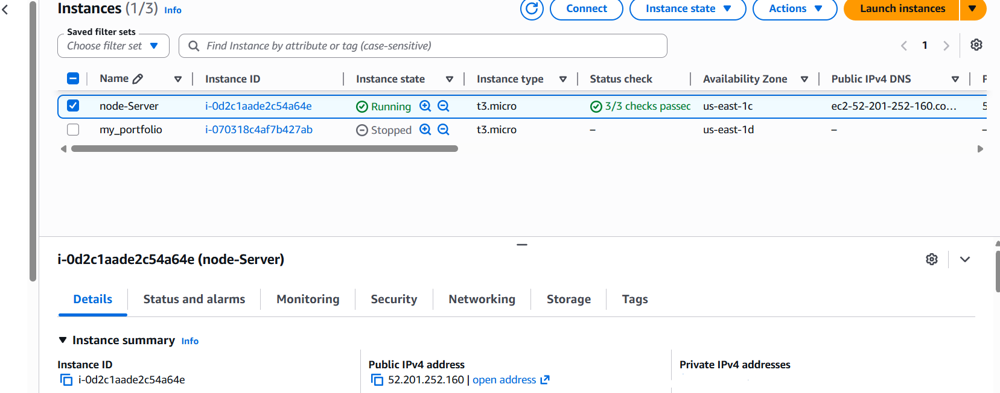
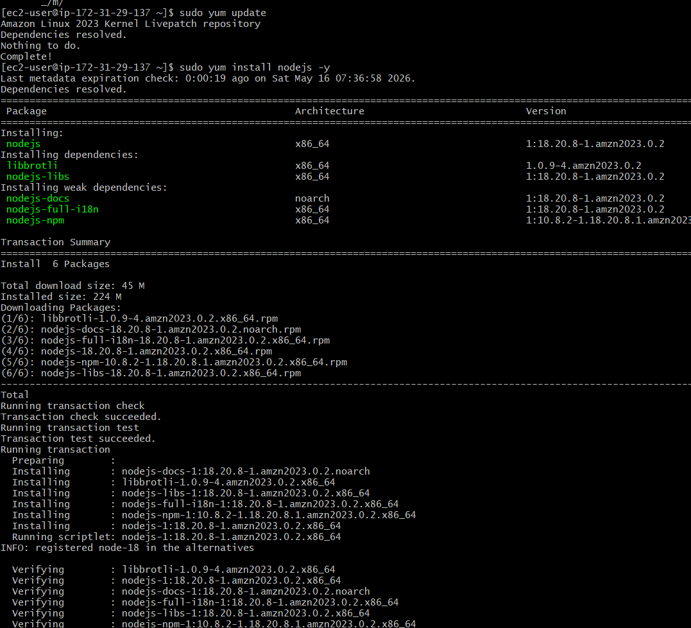
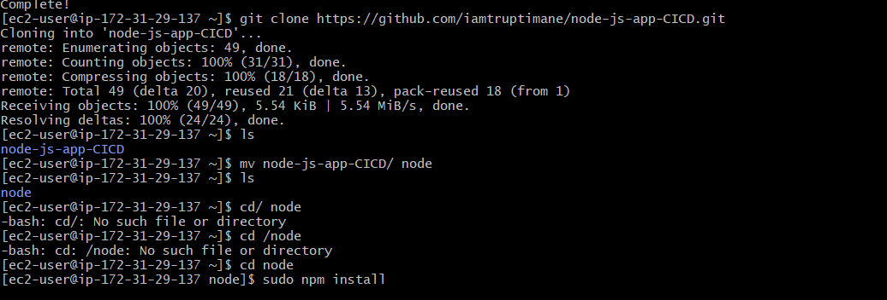
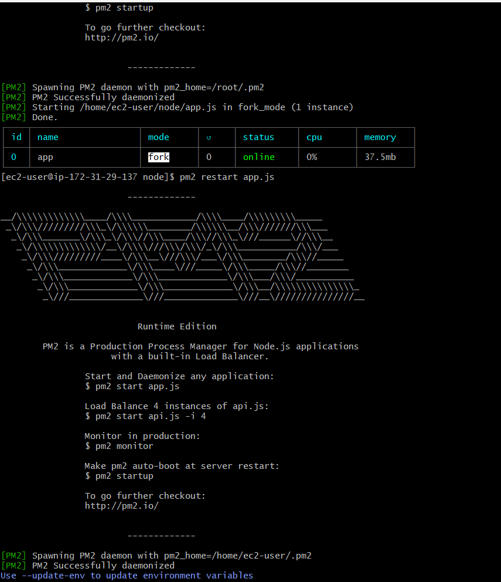
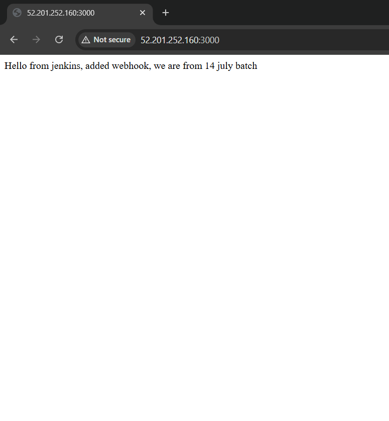

#  Node.js Server Deployment on AWS EC2 using PM2


---

#  Project Overview

This project demonstrates deployment of a Node.js application on AWS EC2 using:

- AWS EC2
- Node.js
- Express.js
- PM2
- GitHub
- Amazon Linux 2023

The application is publicly accessible using the EC2 Public IP on port `3000`.

---

#  Architecture

```text
User Browser
      │
      ▼
AWS EC2 Instance
      │
      ▼
Node.js Application
      │
      ▼
PM2 Process Manager
```

---

#  Project Structure

```bash
node-server-project/
│
├── app.js
├── package.json
├── README.md
└── screenshots/
```

---

#  AWS EC2 Details

| Service | Details |
|---|---|
| Cloud Provider | AWS |
| Instance Type | t3.micro |
| Operating System | Amazon Linux 2023 |
| Runtime | Node.js 18 |
| Process Manager | PM2 |

---

#  Step 1 — Launch EC2 Instance

1. Open AWS Console
2. Go to EC2 Dashboard
3. Click **Launch Instance**
4. Select:
   - Amazon Linux 2023
   - t3.micro
5. Configure Security Group:
   - SSH → Port 22
   - HTTP → Port 80
   - Custom TCP → Port 3000

---

#  Step 2 — Connect to EC2

```bash
ssh -i your-key.pem ec2-user@YOUR_PUBLIC_IP
```

---

#  Step 3 — Update Server

```bash
sudo yum update -y
```

---

#  Step 4 — Install Node.js

```bash
sudo yum install nodejs -y
```

---

#  Verify Installation

```bash
node -v
npm -v
```

---

#  Step 5 — Clone GitHub Repository

```bash
git clone https://github.com/YOUR_USERNAME/node-server-project.git
```

---

#  Move into Project Directory

```bash
cd node-server-project
```

---

#  Step 6 — Install Dependencies

```bash
npm install
```

---

#  Step 7 — Install PM2

```bash
sudo npm install pm2 -g
```

---

#  Step 8 — Start Application using PM2

```bash
pm2 start app.js
```

---

#  Enable Auto Restart on Server Reboot

```bash
pm2 startup
pm2 save
```

---

#  Check Running Applications

```bash
pm2 list
```

---

#  Access Application

Open browser:

```bash
http://YOUR_PUBLIC_IP:3000
```

Example:

```bash
http://52.201.252.160:3000
```

---

#  Application Output

```text
Node Server
Hello from AWS EC2 + Node.js + PM2
CI/CD Deployment Successful 
```

---

#  Screenshots

## AWS EC2 Dashboard



---

## Install Node.js



---

## GitHub Clone & NPM Install



---

## PM2 Running Application



---

## Final Browser Output



---

#  Useful PM2 Commands

## Restart Application

```bash
pm2 restart app.js
```

---

## Stop Application

```bash
pm2 stop app.js
```

---

## Delete Application

```bash
pm2 delete app
```

---

## View Logs

```bash
pm2 logs
```

---

#  Security Group Configuration

| Type | Port |
|---|---|
| SSH | 22 |
| HTTP | 80 |
| Custom TCP | 3000 |

---

#  Future Improvements

- Jenkins CI/CD Pipeline
- Nginx Reverse Proxy
- Docker Containerization
- HTTPS SSL Setup
- Application Load Balancer
- Auto Scaling Group
- Route53 Domain Configuration

---

#  Author

## Nilesh Pradeep Patil

Fortune Cloud Technology  
MCA AWS & DevOps Enginerring

---

#  summary

Successfully deployed a Node.js application on AWS EC2 using PM2 and GitHub integration. The server is publicly accessible and production-ready for future CI/CD implementations.

---